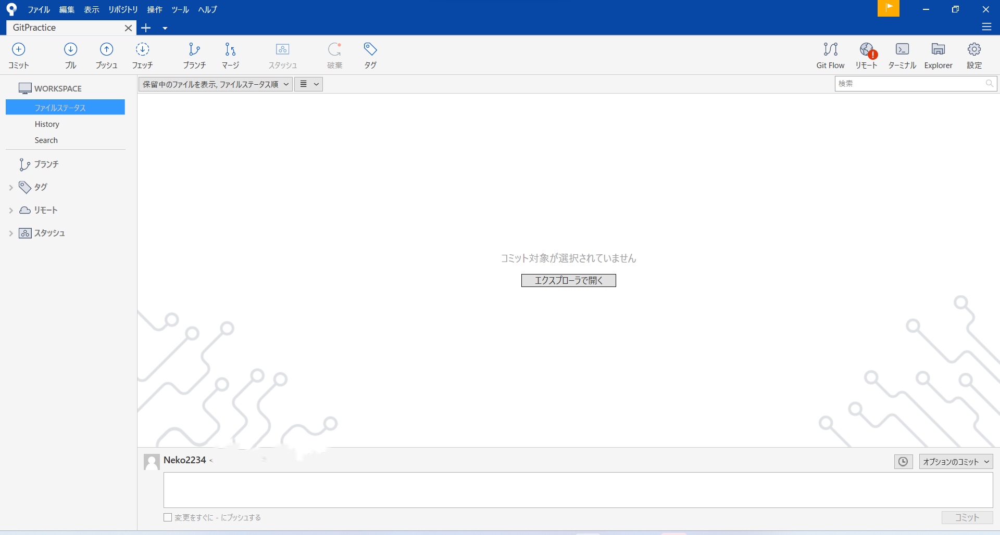
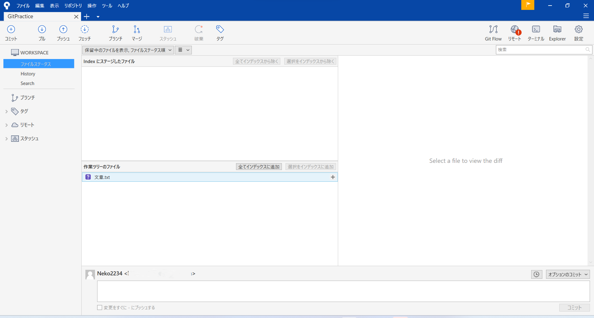
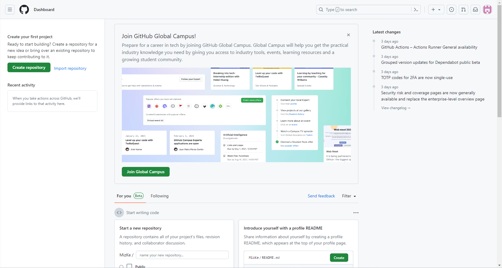
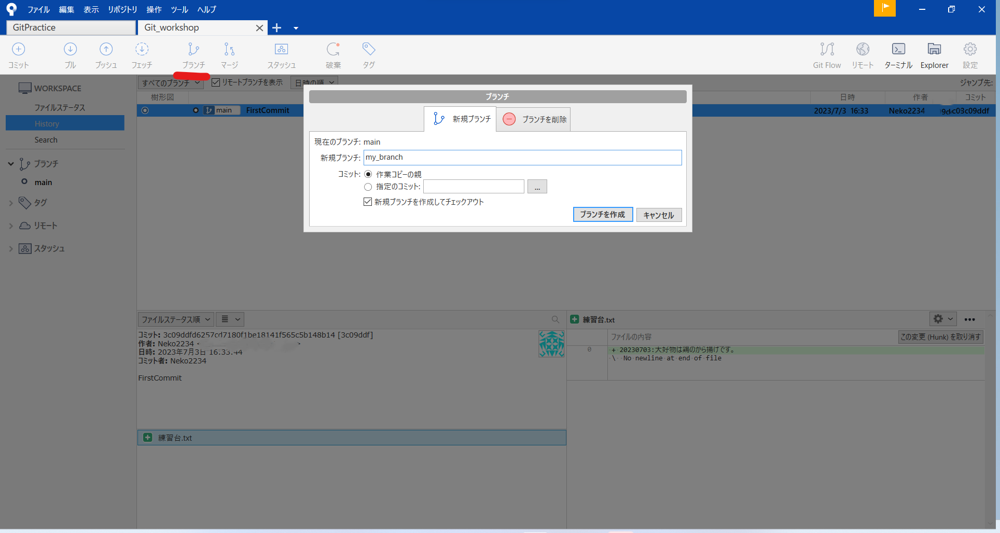
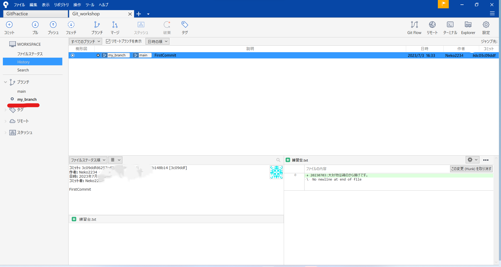

# Git講習資料

## まえがき
ここでは**Git**という大変便利なツールについて紹介します。  

最初はとっつきにくく感じるかもしれませんが、慣れればコードを書く時の心強い友となってくれるので、ぜひ触ってみてください。

なお、この資料に書いてあることに間違いや不備があったら遠慮なく指摘してください。勝手に編集しちゃっても大丈夫です。

## そもそもGitって何？
とはいえGitが何かも分からないのに便利だよと言われても「？？？」って感じだと思います。  

なのでちょっと[Wiki](https://ja.wikipedia.org/wiki/Git)を見てみましょう。

```
Gitは、プログラムのソースコードなどの変更履歴を記録・追跡するための分散型バージョン管理システムである  (Wikipediaより引用)
```

よく分かりませんよね。それで大丈夫です。 

ここで重要なのは、Gitは**バージョン管理システム**だってことです。 

バージョン管理システムとは何かというと、文字通りバージョンを管理してくれるシステムのことです。

例えば皆さん、レポートとかを書いていて「あーここらへんの記述全部書き直したい！」「でも書き直した後『やっぱ違うな…』ってなったとき用に今の記述も残しておきたい！」みたいなことありませんか？

そういうときの対処法として、今の状態のファイルを`テキスト_ver1`として保存しておいて、新しく`テキスト_ver2`を作って編集する、というような方法があると思います。

でもそれってすごくめんどくさいですよね？新しいバージョンができるたびにファイルの数も増えるし、どのファイルでどこの記述を変更したのかもわかりずらいです。

**こうした煩わしさをすべて取り払ってくれるのがGitです**。Gitを使えばファイルは1つのまま、簡単に今まで行ってきた変更を見返したり過去のバージョンに戻したりすることができます。

## Gitをインストールしよう
まずはGitをインストールしましょう。なお、Macの人は最初から入っているのでここはとばしてもらって大丈夫です。 

とはいえここではインストールの解説はしません。[Git公式サイト](https://git-scm.com/)でインストーラがダウンロードできますので、あとはネットで検索して自身の環境に合わせた設定をでインストールしてください。(丸投げ)

終わったらGit Bashを起動します。Git BashはWindows上でGitのコマンドを使うためのツールです。

Git Bashが起動したら以下のコマンドを打ち込んでください。
```
git --version
```
以下のようにGitのバージョンが表示されればインストール完了です。


## 初期設定をしよう
Gitを使うためにはユーザ名とメールアドレスを登録する必要があります。

まず、ユーザ名を登録するために以下のコマンドを入力しましょう。

```
git config --global user.name 任意のユーザ名
```

メールアドレスも同様です。

```
git config --global user.email 任意のメールアドレス
```

できたら、以下のコマンドでちゃんと設定できているか確認しましょう。

```
git config user.name
git config user.email
```

## GitHubのアカウントを作ろう
登録作業が多いですが頑張っていきましょう。

[GitHubのサイト](https://github.co.jp/)にアクセスし、「GitHubに登録する」ボタンをクリックしてください。

そこで、先ほどGit Bashで登録したユーザ名とメールアドレスを入力し、「Create account」ボタンをクリックすれば、登録完了です。　


## SourceTreeをインストールしよう
実はもうすでにGitを使うことはできるんですが、今の状態だとCLI(コマンドラインインタフェース)でしか使えなくてちょっとわかりづらいです。

なので、この講習ではSourceTreeというツールを使って、GitをGUI(グラフィカルユーザインタフェース)で扱えるようにします。

[SourceTreeのサイト](https://www.sourcetreeapp.com/)からインストーラをダウンロードしましょう。

インストーラを起動して、セットアップを行います。

Bitbucketアカウントとの紐づけは今回は行いませんのでスキップでOKです。(後から設定できます)


次にツールのインストール画面が出てきますが、Mercuricalは使いませんので**Mercuricalのチェックはなしで**「次へ」を押してください。(画像ではチェックありになってます、わかりにくくてすみません…)


次の画面でアカウント情報を入力します。

先ほど登録したユーザ名とメールアドレスを入れて「次へ」をクリックします。


次の画面でSSHキーを読み込みますか？と聞かれますが、ここでは「いいえ」としておきます。


以上で設定は完了、SourceTreeが起動します。

## Gitを使おう
長い長い下準備はおしまいです！

ここからいよいよGitを利用していきます。

### リポジトリを作る
リポジトリとは**ファイルの変更点を記録しておくフォルダ**のことです。バージョン管理をするには必須です。

では実際にリポジトリを作ってみます。ここでは例としてデスクトップ上に`GitPractice`という名前のフォルダを作ります。

新しいフォルダができたら、さきほど開いたSourceTreeの「Create」をクリックします。


そうしたら以下のような画面になるはずなので、「参照」で先ほどデスクトップに作った`GitPractice`フォルダを選択しましょう。


できたら、「作成」をクリックしてください。

ここで以下のようなエラーが出るかもしれませんが、「はい」を押して大丈夫です。


以下のような画面が出たらでリポジトリ作成完了です。




### コミットする
さて、リポジトリができても変更点がないんじゃ作った意味がありません。リポジトリに変化を加えてみましょう。

`GitPractice`フォルダを開いて、`文章.txt`という名前のテキストファイルを作ってください。

作れたら、今度はそのテキストファイルに好きな文章を書き込んでください。私は画像のように書き込みました。


ではSourceTreeを開いてみましょう。おや？何か増えてますね。



「作業ツリーのファイル」のところに先ほど`GitPractice`フォルダに追加したテキストファイルが表示されています。

これは、Gitが`文章.txt`が追加されたことを認識している、ということです。

:::info
さて、ここでは少しGitの操作について説明します。

リポジトリとは変更点を保存するフォルダだというお話をしました。

ではどうやって変更点を保存するのかというと、それには**2つの操作**を行う必要があります。1つ目は**ステージ**、2つ目は**コミット**です。

ザックリ簡単に説明すると、**ステージ**とは保存する変更点の選択、**コミット**とはステージされた変更点の保存です。

少し難しいですが、今は「なんかわからんけど2つの工程を挟まんといかんのやな」くらいの認識で大丈夫です。
:::

では話をSourceTreeに戻します。先ほど`文章.txt`が表示されているのを見つけました。

ここで`文章.txt`の隣の「+」か、「全てインデックスに追加」をクリックしてください。

そうすると、「indexにステージしたファイル」に`文章.txt`が移動しました。これが**ステージ**です。

では次に**コミット**を行います。以下の画像のように、下の枠に文章を入れてください。


この文章は**コミットメッセージ**と呼ばれ、保存する変更点の説明を記入します。

コミットメッセージを書くと、右下の「コミット」がクリックできるようになるので、クリックします。

これでコミット完了！下の画像のようになればOKです。


### プッシュをする
ここまででローカルリポジトリの使い方は終わりです。

そう、ここまでは自分のパソコンの中に変更履歴などを保存していたのです。これを**ローカルリポジトリ**といいます。

ここからは**リモートリポジトリ**、つまりネットの世界にリポジトリを置いてしまおう、という話です。

ここからは最初に登録したGitHubを使っていきます。[GitHub](https://github.com/)にアクセスして左上緑色の「Create repository」をクリックします。



そうすれば以下のような画面が出るので、「Repository Name」を入力して一番下の「Create repository」をクリックしてください。(他の設定は変える必要ありません)


これでリモートリポジトリが完成しました！

でもこのままではSourceTreeで操作することはできません。リモートリポジトリが完成したことをSourceTreeにも教えてあげましょう。

まずは出来上がったリモートリポジトリのURLをコピーします。以下の画像の赤い丸で囲われたボタンをクリックすると、このリポジトリのURLがコピーされます。


次はSourceTreeを開きましょう。一番左上にあるヘッダーから「リポジトリ」→「リポジトリ設定」を開くと、以下のようなウィンドウが表示されます。   
「追加」をクリックして**リモートリポジトリ**の名前とURLを入力しましょう。完了したら「OK」です。


これでローカルリポジトリとリモートリポジトリの紐づけが終わりました。 

しかし、今のままではローカルリポジトリとリモートリポジトリで中身が違っています。ローカルリポジトリには「文章.txt」がありますが、リモートリポジトリは空っぽです。

なので、ローカルリポジトリの変更をリモートリポジトリに反映させる必要があります。この操作を**プッシュ**といいます。

SourceTreeの左上、上矢印が書かれた「プッシュ」ボタンをクリックしましょう。そうすると、以下の画像のようなウィンドウが表示されます。「プッシュするブランチ」の「対象」のチェックボックスにチェックを入れて、「プッシュ」をクリックします。


これで完了です。GitHubのリモートリポジトリのページを見てみましょう。   
画像のように変更が反映されていれば成功です。


### クローンする
ここからは実際にチームで開発をするうえで行う操作の練習をします。    

チーム開発を行う際は既にあるリモートにあるリポジトリを編集することが多いです。    
その場合、そのリモートリポジトリをローカルにコピーして編集を行います。この操作を**クローン**といいます。

まずはコピー先となるフォルダをデスクトップに作成します。名前は`Git_workshop`としましょう。

次には[tsukuroboのGitHubページ](https://github.com/tsukurobo)にアクセスしてください。   
ここで作ったプログラムをリモートリポジトリとして管理しています。

ここの「Repositories」の中から、「Git_workshop」リポジトリにアクセスしてください。「〈〉Code」をクリックして表示されたポップアップからリポジトリのURLをコピーしましょう。


ではSourceTreeを開きます。    
上部のタブメニューの「+」をクリックし、「クローン」を選択します。

以下の画像のように、「元のパス/URL」には先ほどコピーしたURLを貼り付けます。    
「保存先のパス」には、「参照」から先ほどデスクトップに作成した`Git_workshop`フォルダを選択してください。


次に**ブランチ**を作成します。これは自分が今作業している枝を指します。ここでは詳細は割愛しますが、このブランチを使うことで同時に行われる色々な変更をそれぞれ別々に管理することができるようになります。    
例えば、機能Aと機能Bを同時に実装したいとき、機能Aのブランチ、機能Bのブランチ、と分けて作業することで効率よく実装が行えます。

SourceTreeの「ブランチ」をクリックすると以下の画像のようなウィンドウが表示されるので、ブランチの名前を付けましょう。ブランチの名前は「(アカウント名)_branch」としてください。    
終わったら「ブランチを作成」をクリックします。



下のようにブランチが追加され、新しく作ったブランチの名前(画像ではmy_branch)が**太字**で表示されていることを確認してください。この状態を「my_branchに**チェックアウト**している」といいます。



ではこのリポジトリにある`練習台.txt`を編集してみましょう。    
以下の画像のように何かしら追記してみましょう。困ったら好物のことでも書いてください。


↓


できたら保存してSourceTreeを開き、この変更をコミットします。

ここで、「ブランチ」のところの「main」をダブルクリックして、「main」ブランチにチェックアウトしてみましょう。

そうすると、さっきの変更が「main」ブランチには反映されていないことがわかると思います。

### プルリクエストを作る
これでmy_branchに自分だけの変更を反映させることができました。    
今度はこの変更をmainブランチにも反映させます。この操作を**マージ**といいます。

ただその前に、そのマージに問題がないかどうかをほかの人にチェックしてもらう必要があります。    
というのも、今回は文章なのであまり関係ないですが、これがプログラムのコードだとバグがあるコードをmainブランチにマージしてしまう可能性があります。

そうならないよう、マージする前にほかの人に変更内容を検閲してもらうために行うのが**プルリクエスト**です。俺の変更をプルしてくれ～ってクローン元に要求するわけですね。

では早速プルリクエストを作っていきます。    
まずは先ほどのmy_branchへの変更をプッシュしましょう。

終わったら今度はGitHubのGit_workshopリポジトリのページを開いてください。
上部のタブメニューから「Pull requests」を選択し、「New pull request」をクリックします。


そうすると以下の画像のような画面になるので、赤線を引いた部分に注目してください。    
ここのbaseをmainに、compareを各自が作ったブランチ（アカウント名_branch）に変更してください。これはcompareのに設定したブランチでの変更をbaseの方のブランチにも反映させますよということです。

できたら、「Create pull request」をクリックしてください。


そのあとは以下のようになるので、コメントの部分に変更の詳細を記入してください。自分がどういう変更を行ったのかを検閲してもらう人に伝えるわけです。    
そのあと「Create pull request」をクリックします。


これにて、プルリクエスト完了です！

あとはだれか他の人がプルリクエストみてマージしてくれれば、変更がmainブランチに反映されます。

## 終わりに
以上でGit講習は終わりです！Gitの便利さが少しでも伝わったでしょうか？    
今回の講習で説明した操作はGitのほんの一部にすぎないので、興味がある方は自分で調べてみてください。    
また、今回はSourceTreeを用いてGitを使いましたが、vscodeの拡張機能を使っても似たようなことができますし、コマンドを使って操作することもできます。SourceTreeじゃないとダメってこともないので、自分に合ったツールを探してみるのもいいでしょう。    
この講習が、みなさんがGitを使う足掛かりになれたなら幸いです。
